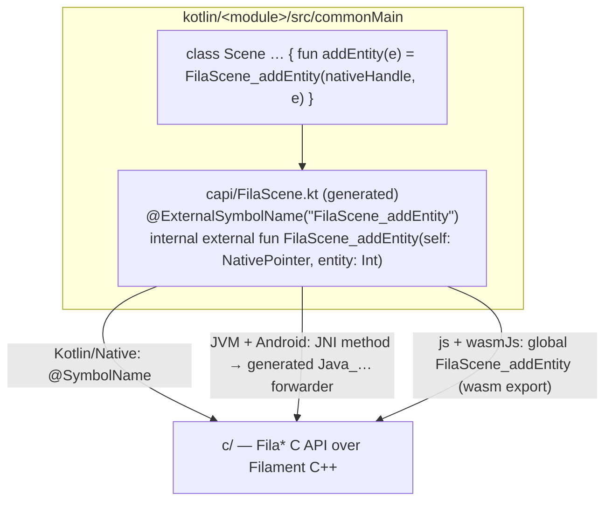

# Native Bindings

How the Kotlin API reaches the C API on each platform. Read this before adding or changing a binding.
Where the C API itself comes from (generated from Filament's C++ headers) is covered in
[The Generated C API](c-api.md).

## The idea

Each API class (`Scene`, `View`, `Engine`…) is written **once, in `commonMain`**, and calls our
C API (`c/`, the `Fila*` functions) through `external fun` declarations generated from the C headers
into the module's `capi` package (`./gradlew generateKotlinExternals`). There
are no per-platform `actual`s for API logic. Only the way an `external fun` reaches its C symbol
differs by platform, and nobody writes that part by hand. This is the model
[skiko](https://github.com/JetBrains/skiko) uses for Skia.



| Platform | How an `external fun` binds | Glue | Native library |
| :--- | :--- | :--- | :--- |
| iOS (Kotlin/Native) | `@ExternalSymbolName` is a typealias to `@SymbolName`: a direct call to the C symbol | none | `c/` static libs, packed into the klib |
| JVM desktop | JNI `native` method on the file's facade class | forwarders generated from the Kotlin declarations (`:generateBindings`) | `libfilament-c` per host (`:desktop`) |
| Android | same as JVM (shared `jniMain` source set) | same | `libfilament-c.so` per ABI (`:android`) |
| js, wasmJs | resolved **by name** as a JS global | export lists + type tables generated from the Kotlin declarations; the runtime installs the exports as globals | `filament-kmp.wasm` (`:web`) |

## Anatomy of a class

```kotlin
// kotlin/filament/src/commonMain/kotlin/io/github/erkko68/filament/Scene.kt
import io.github.erkko68.filament.capi.*

class Scene @InternalFilamentApi constructor(internal var nativeHandle: NativePointer) {

    fun addEntity(entity: Entity) = FilaScene_addEntity(nativeHandle, entity)

    fun addEntities(entities: IntArray) = interopScope {
        FilaScene_addEntities(nativeHandle, toInterop(entities), entities.size)
    }

    fun hasEntity(entity: Entity): Boolean = FilaScene_hasEntity(nativeHandle, entity)
}
```

Each class also exposes its handle as `@InternalFilamentApi val nativeObject: NativePointer`, for
code that calls the C API directly.

## Declaring a binding

Adding API is almost always a regenerate: list the header in `c/api-headers.txt` (or pick up a new
Filament release), run `./gradlew generateCApi generateKotlinExternals`, then write the public Kotlin
method over the new external. Only a `TODO(handwritten)` needs C written by hand, in
`c/<module>/manual` (see [The Generated C API](c-api.md#hand-written-leftovers-cmodulemanual)).

The generators follow these rules at the boundary; a hand-written `manual` function must too, since its
Kotlin external is generated from its header the same way.

1. **The Kotlin function is named exactly like the C function**, repeated in `@ExternalSymbolName`.
   Web resolves it by the Kotlin name and Native by the annotation, so the two must match.
2. **Only these Kotlin types** cross the boundary:

   | C type | Kotlin type |
   | :--- | :--- |
   | any pointer (`FilaX*`, `const float*`, `void*`, callbacks) | `NativePointer` |
   | `int32_t`, `uint32_t`, enums, `FilaEntity` | `Int` |
   | `int64_t`, `uint64_t` | `Long` — as a parameter only; return 64-bit values through an out-pointer |
   | `float` / `double` | `Float` / `Double` |
   | `bool` | `Boolean` |

3. **The C side uses fixed-width types.** No `size_t`, `long` or `ptrdiff_t` in a `Fila*`
   signature. There is no per-platform glue on Native and web to adapt widths, so a Kotlin type
   has to match the C ABI on every target: `size_t` is 64-bit on JVM/Android-arm64/iOS but 32-bit
   on wasm32. Use `uint32_t` for counts and sizes.
   No 8- or 16-bit integer *parameters* either (`bool` is fine): Apple arm64 packs stack arguments
   by their natural size, so a Kotlin `Int` passed where C takes `uint8_t` shifts every later stack
   argument on iOS. Widen them to `int32_t`/`uint32_t`.
4. **No structs by value** across the boundary. Pass or return them through a pointer.

Nothing else needs updating: the JNI glue is regenerated on the next build, Native links the
symbol directly, and web looks it up in the wasm exports (every `Fila*` in the C headers is
exported).

### Arrays and native memory

The usual form is `usePinned`, available for every primitive array type. The block gets the array's
address, and whatever C wrote there is back in the array afterwards:

```kotlin
val rotation: FloatArray get() = FloatArray(9).also { r -> r.usePinned { FilaIndirectLight_getRotation(nativeHandle, it) } }
```

When pointers must outlive one call (a C++ builder that reads them at `build()`), keep an
`InteropScope` as a field and `release()` it after `build()`. For several arrays in one call, use an
`interopScope`. `toInterop(array)` returns a pointer valid until the
scope ends; `ptr.fromInterop(array)` copies back what C wrote into it:

```kotlin
// C: bool FilaEngine_getFeatureFlag(const FilaEngine* self, const char* name, bool* out) — a std::optional<bool> result
fun getFeatureFlag(name: String): Boolean? = interopScope {
    val out = ByteArray(1)
    val ptr = toInterop(out)
    val present = FilaEngine_getFeatureFlag(nativeHandle, toInterop(name), ptr)
    ptr.fromInterop(out)
    if (present) out[0] != 0.toByte() else null
}
```

On Native the array is pinned (no copy, `fromInterop` is a no-op); on JVM/Android and web it is
copied into native memory and freed when the scope ends.

### Strings

A `const char*` parameter takes `name.useCString { … }` (or `toInterop(string)` inside a scope): a
NUL-terminated UTF-8 copy for the call. A returned `const char*` goes through
`stringFromInterop(ptr)`, which returns null for a null pointer.

```kotlin
fun hasParameter(name: String): Boolean = name.useCString { FilaMaterial_hasParameter(nativeHandle, it) }
val name: String get() = stringFromInterop(FilaMaterial_getName(nativeHandle)) ?: ""
```

### Callbacks

`Callbacks.register(once) { arg -> … }` returns the `userData` for a C callback; pass
`Callbacks.userOnly` (`void (*)(void*)`) or `Callbacks.argUser` (`void (*)(T*, void*)`) as the
function pointer. A `once` callback frees itself after firing; `Callbacks.release(userData)` the
others once C can no longer call them. The lambda runs on whichever thread C calls from (usually
Filament's driver thread; on web, during the frame tick). Async completions also pass an
`AsyncCallStatus`: register them with `Callbacks.registerStatus(once) { arg, status -> … }` and pass
`Callbacks.userStatus` (`void (*)(void*, status)`) or `Callbacks.argUserStatus` (`void (*)(T*, void*, status)`).

### Asynchronous uploads

`set*Buffer` and `setImage` hand Filament data it reads later, on the driver thread, so no scope
can own it. `upload(data, size, onRelease)` returns the pointer and size plus the C release callback
and its userData; pass all four to the call:

```kotlin
val upload = upload(data, size, callback)
FilaIndexBuffer_setBuffer(nativeHandle, engine.pointer, upload.ptr, upload.size, offset, NullPointer, upload.callback, upload.userData)
```

Native pins the array; JVM/Android and web copy it. Once Filament is done, the callback unpins or
frees it, then runs `onRelease`.

## The interop runtime

`kotlin/filament/src/*/kotlin/io/github/erkko68/filament/interop/` holds the whole per-platform
part:

| Declaration | common | `jniMain` (JVM + Android) | `nativeMain` | `webMain` |
| :--- | :--- | :--- | :--- | :--- |
| `NativePointer` | `expect class` | `Long` | `Long` | `Int` (wasm32 address) |
| `NullPointer` | `expect val` | `0L` | `0L` | `0` |
| `ExternalSymbolName` | `@OptionalExpectation` | absent | `kotlin.native.SymbolName` | absent |
| `InteropScope` | `expect class` | copies via `FilaJni` | pins | copies into the wasm heap |
| `singleThreaded` | `expect val` | `false` | `false` | `true` (wasm has no threads: no blocking waits) |

`jniMain` is a source set shared by `jvm` and `android` (declared in the `filament-kmp-module`
convention plugin); both reach the C API through the same JNI layer.

`@SymbolName` needs the `kotlin.native.SymbolNameIsInternal` opt-in at every use site, commonMain
included. The convention plugin opts every source set in, as skiko does
([KT-46649](https://youtrack.jetbrains.com/issue/KT-46649)).

## Per platform

### JVM and Android: generated JNI glue

A common `external fun` compiles to a JNI `native` method on its file's facade class
(`Scene.kt` → `io.github.erkko68.filament.SceneKt`, or the `@file:JvmName`). JNI only finds it
under a mangled C name, so `:generateBindings`
([`buildlogic.apigen.externals`](../../build-logic/src/main/kotlin/buildlogic/apigen/externals)) scans
`kotlin/*/src/commonMain` for `@ExternalSymbolName` externals and writes one forwarder each:

```c
JNIEXPORT void JNICALL Java_io_github_erkko68_filament_SceneKt_FilaScene_1addEntity(JNIEnv* env, jclass cls, jlong scene, jint entity) {
    FilaScene_addEntity((void*)(intptr_t) scene, entity);
}
```

The output is a build artifact (`build/generated/bindings/jni/`), not committed. The JNI image
(`jni/CMakeLists.txt`) compiles it in for both `:desktop:cmakeBuild` and `:android:cmakeBuild_<abi>`. The
forwarders include every `Fila*` header, so the C compiler checks each call against the real prototype. A
Kotlin declaration that disagrees on arity or on pointer-vs-integer fails to compile.

`Filament.init()` loads the library: `System.loadLibrary` on Android, and on desktop
[`FilamentLoader`](../../desktop/src/main/java/io/github/erkko68/filament/desktop/FilamentLoader.java),
which extracts it from the runtime jar into a content-hashed cache dir.

### Kotlin/Native: direct calls

`@SymbolName` makes the call go straight to the C symbol; there is no stub or cinterop wrapper
in between. Each module still has a cinterop, but a header-less one generated by build-logic: it only
packs the `c/` static libraries and Filament's archives into the klib so the symbols are there at link time.

One behavior to know: a `@SymbolName` call doesn't switch the thread to the Native state the way
a cinterop call does. A long C call (a blocking `flushAndWait`) holds up a stop-the-world GC on
other threads until it returns. Skiko has the same trade-off.

### Web: exports as globals

A top-level `external fun` with no `@JsModule` resolves to a global of the same name on both js
and wasmJs. As soon as `filament-kmp.wasm`'s runtime is up, it copies every `_FilaX` export onto
`globalThis.FilaX` itself ([`fila-globals.js`](../../web/src/wasm/fila-globals.js), linked in with
`--post-js`), so no Kotlin call has to come first.

The js target sees raw wasm values, so `:generateBindings` also writes three lists from the Kotlin
declarations, linked onto the module, and `fila-globals.js` wraps those globals (the conversions are no-ops
on wasmJs). The same pass writes each runtime's export list, so the wasm exports exactly what Kotlin binds:

| List | Why | Wrapper |
| :--- | :--- | :--- |
| `filaBoolExports` (`bool` results) | wasm returns `0`/`1`; `true == 1` is `false` in Kotlin/JS | `!== 0` |
| `filaF32Exports` (`float` results) | Kotlin/JS keeps a `Float` as a double (`0.35f` reads back as `0.3499999940395355`) | shortest decimal with the same f32 value |
| `filaI64Exports` (64-bit parameters) | Kotlin/JS `Long` is an object, not a BigInt | `BigInt(x.toString())` |

A 64-bit *result* can't be turned back into a Kotlin/JS `Long`, hence the out-pointer rule above.

`filamat-kmp.wasm` is a separate module and installs its own globals the same way, but its heap is not
`filament-kmp.wasm`'s: the common `interopScope`/`useCString` copies land in the wrong module. filamat's
strings and package bytes go through its own `useFilamatCString`/`readFilamatBytes` instead.

## Testing a binding

- Every common test runs on all five targets. When you test a `Boolean` result, assert it
  strictly (`assertEquals(true, x)`): `assertTrue` passes for the number `1` on js.
- A missing JNI forwarder fails as `UnsatisfiedLinkError` on the first call, a missing Native
  symbol at link time, and a missing web global as `ReferenceError`. The JVM, iOS and js runs
  catch all three.

```sh
./gradlew :kotlin:filament:jvmTest :kotlin:filament:iosSimulatorArm64Test \
          :kotlin:filament:jsBrowserTest :kotlin:filament:wasmJsBrowserTest
./gradlew :kotlin:filament:connectedAndroidDeviceTest   # device or emulator
```

## Value structs

C++ value structs (`BloomOptions`, `Engine.Config`, `LightManager.ShadowOptions`) cross as handles, never
by value: the C API gives each a `_create` (seeded with the C++ defaults), `_destroy` and a getter/setter
per field. The Kotlin side is a plain class with `var` fields; a property like `View.bloomOptions` copies
it into a temporary handle on set and out of one on get, so the getter returns a snapshot: mutate it and
assign it back.
