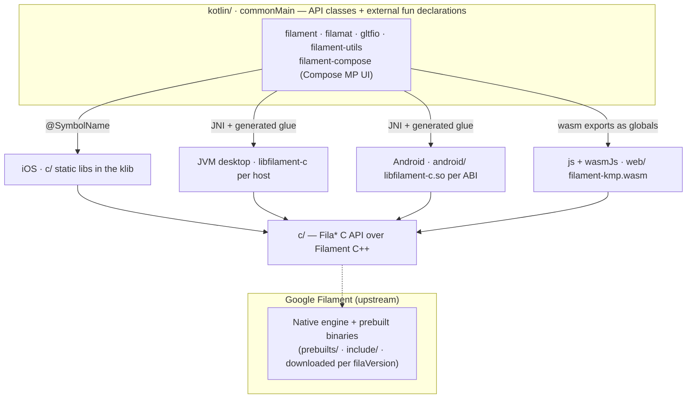

# Repository Structure

The `filament-kmp` project is organized into several modules to handle the cross-platform nature of the Filament engine.

## Architecture at a glance

The API is written once in `commonMain`: each class holds a native pointer and calls our C API
(`c/`) through `external fun`s declared next to it, the model skiko uses for Skia. Only the way an
`external fun` reaches its C symbol differs per platform, and none of that is hand-written. See
[Native Bindings](bindings.md) for the details and the rules for adding one.

## Core Modules

- **`c/`**: C++ wrapper that exposes a C-compatible ABI (the `Fila*` functions) around the official Filament C++ API; every platform builds it. `c/CMakeLists.txt` is the one CMake entry point: each C module (`filament`, `filamat`, `filament-utils`, `gltfio`) compiles once into an OBJECT library, and the platform's consumer links them — static libraries for **Kotlin/Native** (`lib<module>-c.a`), the JNI image `libfilament-c` for the **desktop** and **Android** (`jni/CMakeLists.txt`), and `filament-kmp.wasm` + `filamat-kmp.wasm` for **web** (`web/CMakeLists.txt`). `c/cmake/` imports Filament's archives and sets per-platform compiler flags. Each module's C-ABI types live in its own `*Types.h` header (core types in `filament/c/FilaTypes.h`).

- **`jni/`**: The JNI runtime shared by desktop and Android: native memory and callbacks (`FilaJni`) and the JNI image's CMake. See [`jni/README.md`](../jni/README.md).

- **`desktop/`**: The desktop runtime: builds `libfilament-c` for the host and ships `FilamentLoader`, plus one `runtime-<os>-<arch>` jar per platform. See [`desktop/README.md`](../desktop/README.md).

- **`android/`**: The Android runtime: `libfilament-c.so` per ABI with the NDK, over upstream's `android-native` prebuilts. See [`android/README.md`](../android/README.md).

- **`web/`**: The web runtime (`js` + `wasmJs`): builds `filament-kmp.{js,wasm}` (+ `filamat-kmp.{js,wasm}`) with Emscripten, loads it and installs its exports as the globals the common `external fun`s bind to, and holds the heap/callback/WebGL helpers. See [`web/README.md`](../web/README.md).

- **`kotlin/`**: The core Kotlin Multiplatform wrapper. API classes and their `external fun` declarations live in each module's `commonMain`; the small per-platform interop runtime (`NativePointer`, `InteropScope`) is in `kotlin/filament`'s `interop/` package. Contains five modules:
    - `filament` — Core engine components (Engine, Scene, View, Renderer, …).
    - `filamat` — Material compilation (MaterialBuilder).
    - `gltfio` — glTF asset loading (AssetLoader, FilamentAsset, Animator, …).
    - `filament-utils` — Math utilities, camera manipulators, HDR/KTX loaders.
    - `filament-compose` — Compose Multiplatform UI integration layer (see [Compose docs](compose/README.md)).

- **`prebuilts/`**: Filament's static libraries per target (`prebuilts/<id>/lib`, ids from `FilamentTarget`: `ios-arm64`, `macos-arm64`, `android-arm64-v8a`, `wasm`, …), fetched by the `prebuilts_<id>` tasks: a download from the upstream GitHub release, or a build from the release's source for targets upstream ships none for (`wasm`, `windows-arm64`). The matching public headers land in `include/` via `downloadIncludes`. Git-ignored.

- **`samples/`**: Multiplatform example applications for Android, iOS, Desktop (JVM), and Web.

## Binding Strategy by Platform

| Platform | How a common `external fun` binds | Native library | Source |
| :--- | :--- | :--- | :--- |
| **Android** | JNI, forwarders generated from the Kotlin declarations | `libfilament-c.so` per ABI | `android/` + `jni/` + `c/` + `prebuilts/android-*` |
| **JVM / Desktop** | JNI, same forwarders | `libfilament-c` per host | `desktop/` + `jni/` + `c/` + `prebuilts/<os>-<arch>` |
| **iOS** | `@SymbolName`, a direct call to the C symbol | `c/` static libs in the klib | `c/` + `prebuilts/` |
| **Web / WASM** | by name, against the wasm exports installed as globals | `filament-kmp.wasm` | `web/` + `c/` + `prebuilts/wasm/` |

## Build System

The project uses **Gradle (Kotlin DSL)** for dependency management and build orchestration; the convention plugins and build tasks live in `build-logic/`.

Everything native goes through `build-logic`'s `buildlogic.*` tooling:

- **`FilamentTarget`** (`platform/`) is the one list of native targets and where their Filament libraries come from.
- **Prebuilts** (`prebuilts/`): the root `prebuilts_<id>`, `downloadIncludes` and `setupEmsdk` tasks.
- **Bindings** (`bindings/`): `:generateBindings` reads the common `@ExternalSymbolName` externals and writes the JNI forwarders and the wasm export lists and type tables (`build/generated/bindings/`, not committed).
- **CMake** (`cmake/`): one `CMakeBuildTask` type drives every `c/` build — `:cmakeBuild_<ios id>` (packed into the iOS klibs through a header-less cinterop), `:desktop:cmakeBuild`, `:android:cmakeBuild_<abi>` and `:web:cmakeBuild`.
